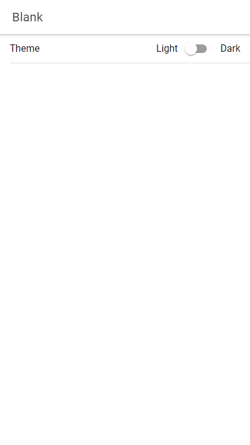

# Ionic Angular Dark Mode Toggle
##### In this repository you will learn how to create a simple dark mode toggle using Ionic 6 and Angular 14.

### Screenshots
##### Home page

## License

MIT

**Free Software, Hell Yeah!**

[//]: # (These are reference links used in the body of this note and get stripped out when the markdown processor does its job. There is no need to format nicely because it shouldn't be seen. Thanks SO - http://stackoverflow.com/questions/4823468/store-comments-in-markdown-syntax)

[dill]: <https://github.com/joemccann/dillinger>
[git-repo-url]: <https://github.com/joemccann/dillinger.git>
[john gruber]: <http://daringfireball.net>
[df1]: <http://daringfireball.net/projects/markdown/>
[markdown-it]: <https://github.com/markdown-it/markdown-it>
[Ace Editor]: <http://ace.ajax.org>
[node.js]: <http://nodejs.org>
[Twitter Bootstrap]: <http://twitter.github.com/bootstrap/>
[jQuery]: <http://jquery.com>
[@tjholowaychuk]: <http://twitter.com/tjholowaychuk>
[express]: <http://expressjs.com>
[AngularJS]: <http://angularjs.org>
[Gulp]: <http://gulpjs.com>

[BOOTSTRAP]: <https://www.npmjs.com/package/bootstrap>
[BOOTSWATCH]: <https://www.npmjs.com/package/bootswatch>
[FONT_AWESOME]: <https://www.npmjs.com/package/font-awesome>
[GSAP]: <https://www.npmjs.com/package/gsap>
[NGX_BOOTSTRAP]: <https://www.npmjs.com/package/ngx-bootstrap>
[NGX_SPINNER]: <https://www.npmjs.com/package/ngx-spinner>
[XNG_BREADCRUMB]: <https://www.npmjs.com/package/xng-breadcrumb>
[ANGULAR_NOTIFIER]: <https://www.npmjs.com/package/angular-notifier>
