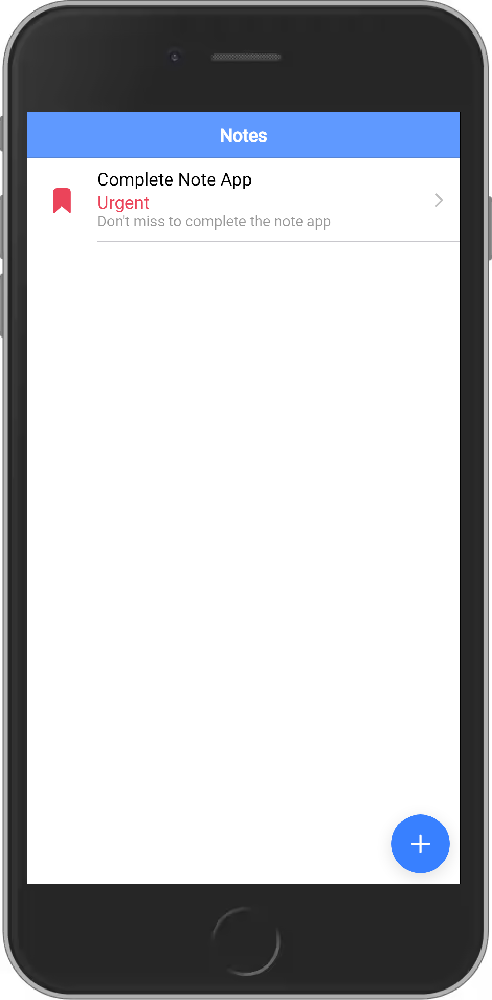
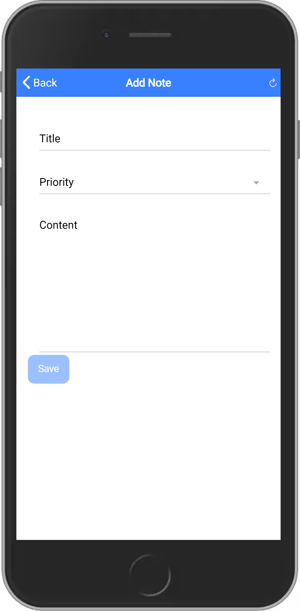
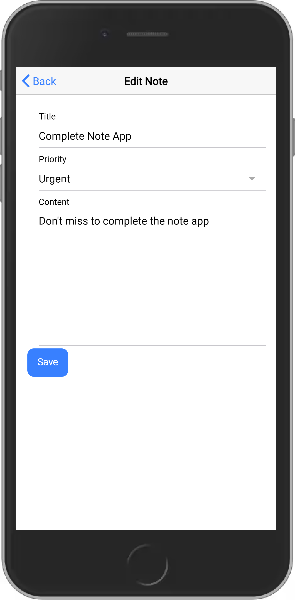
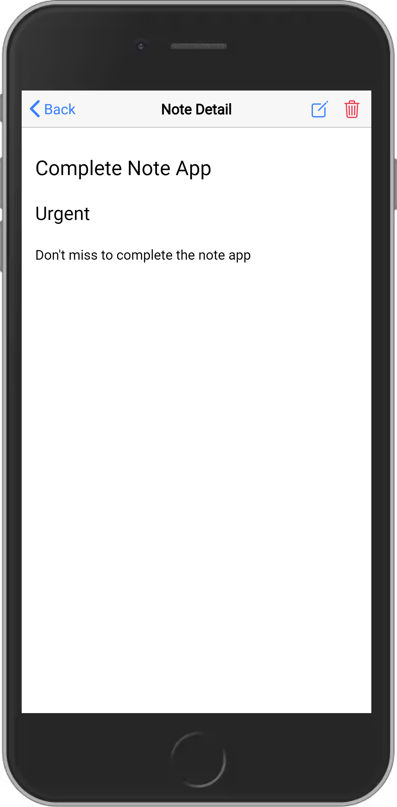
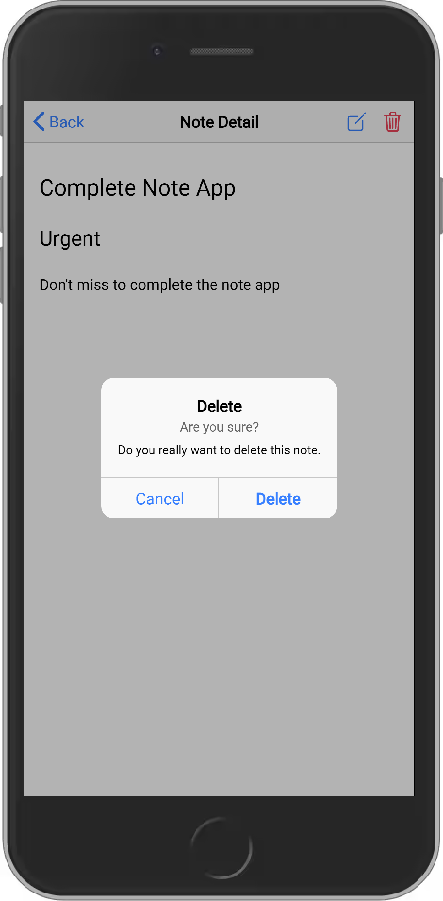

# Ionic Angular Firestore CRUD Operations
##### In this repository you will learn how to create a simple Notes application using Ionic 6 and Angular 14.

### About
The Note application will be able to perform the read, create, update and delete operations, and Firestore database in the Firebase will be used as database.

### Screenshots
##### List notes

##### Add nete

##### Edite note

##### Display note

##### Delete note

## Conclusion
In this repository you learned how to perform the CRUD operations in Firestore database inside Firebase using Ionic 6 application which was created using Angular 14.
I started with setting up the Firebase project to get firestore database settings. Then i created the ionic 5 application using ionic CLI and then added support for all of the Read, Create, Update and Delete operations.

## License

MIT

**Free Software, Hell Yeah!**

[//]: # (These are reference links used in the body of this note and get stripped out when the markdown processor does its job. There is no need to format nicely because it shouldn't be seen. Thanks SO - http://stackoverflow.com/questions/4823468/store-comments-in-markdown-syntax)

[dill]: <https://github.com/joemccann/dillinger>
[git-repo-url]: <https://github.com/joemccann/dillinger.git>
[john gruber]: <http://daringfireball.net>
[df1]: <http://daringfireball.net/projects/markdown/>
[markdown-it]: <https://github.com/markdown-it/markdown-it>
[Ace Editor]: <http://ace.ajax.org>
[node.js]: <http://nodejs.org>
[Twitter Bootstrap]: <http://twitter.github.com/bootstrap/>
[jQuery]: <http://jquery.com>
[@tjholowaychuk]: <http://twitter.com/tjholowaychuk>
[express]: <http://expressjs.com>
[AngularJS]: <http://angularjs.org>
[Gulp]: <http://gulpjs.com>

[BOOTSTRAP]: <https://www.npmjs.com/package/bootstrap>
[BOOTSWATCH]: <https://www.npmjs.com/package/bootswatch>
[FONT_AWESOME]: <https://www.npmjs.com/package/font-awesome>
[GSAP]: <https://www.npmjs.com/package/gsap>
[NGX_BOOTSTRAP]: <https://www.npmjs.com/package/ngx-bootstrap>
[NGX_SPINNER]: <https://www.npmjs.com/package/ngx-spinner>
[XNG_BREADCRUMB]: <https://www.npmjs.com/package/xng-breadcrumb>
[ANGULAR_NOTIFIER]: <https://www.npmjs.com/package/angular-notifier>
